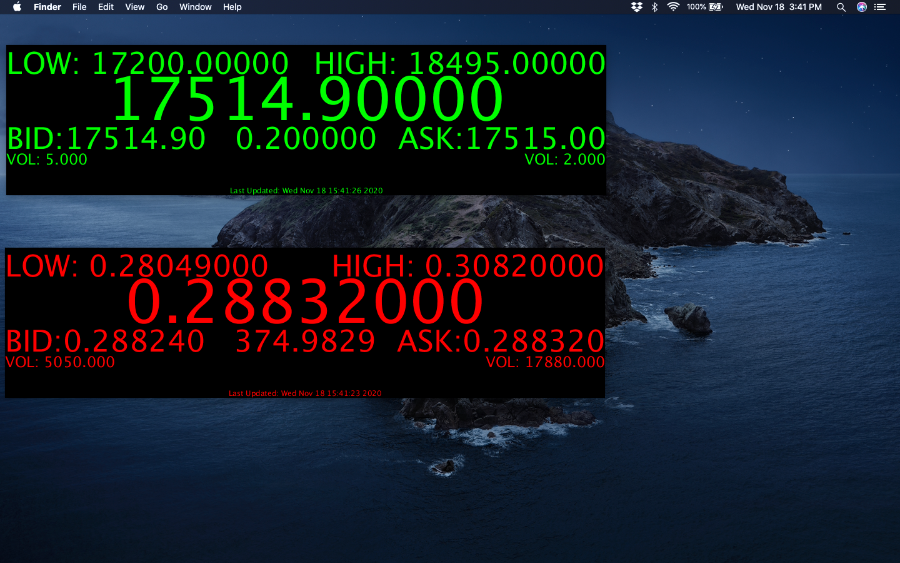

# KrakenTicker

Screenshot of ticker in action. Live market data for BTC/USD and XRP/USD are shown, respectively.

Simple ticker that display and monitors current trading pairs on Kraken's exchange.
### Features
Standalone ticker widget that display's current market data. Accompanied python script retrieves data live, and saves the data into a CSV file.
Current displayed data:
 - 24 Hour Low
 - 24 Hour High
 - Last Trade Price and Volume
 - Last Bid Price and Volume
 - Last Ask Price and Volume
 - Last Traded Price and Volume
 - Last time Data was updated

### Python Script
 - Retrieves data from Kraken's servers by using their REST API
 - Parses JSON response
 - Formats into CSV
 - saves to text file
 - Retrieves data once every three seconds to prevent reaching API call limit
 - Exported data is easily usable with industry standard software like Excel

### Ticker Widget
Standalone widget that is not dependent on Kraken's web app. Desktop application provides stability, lower latency, and speed boost provided by native code. It is less CPU and Memory intensive than Kraken's web app. It is configurable and convenient.

### Technology Used

 - Python
 - Java
 - HTTP
 - Rest API
 - JSON
 - CSV
 - Data Management

## Usage Example
KrakenTicker is a processing project. You can either open the project in Processing, or use the provided executable to check  BTC/USD pair. Make sure you run the python script inside the data folder to update the CSV files.
Python script usage:

    ./krakentickercsv symbol
    ./krakentickercsv XXBTZUSD
    ./krakentickercsv XXRPZUSD
